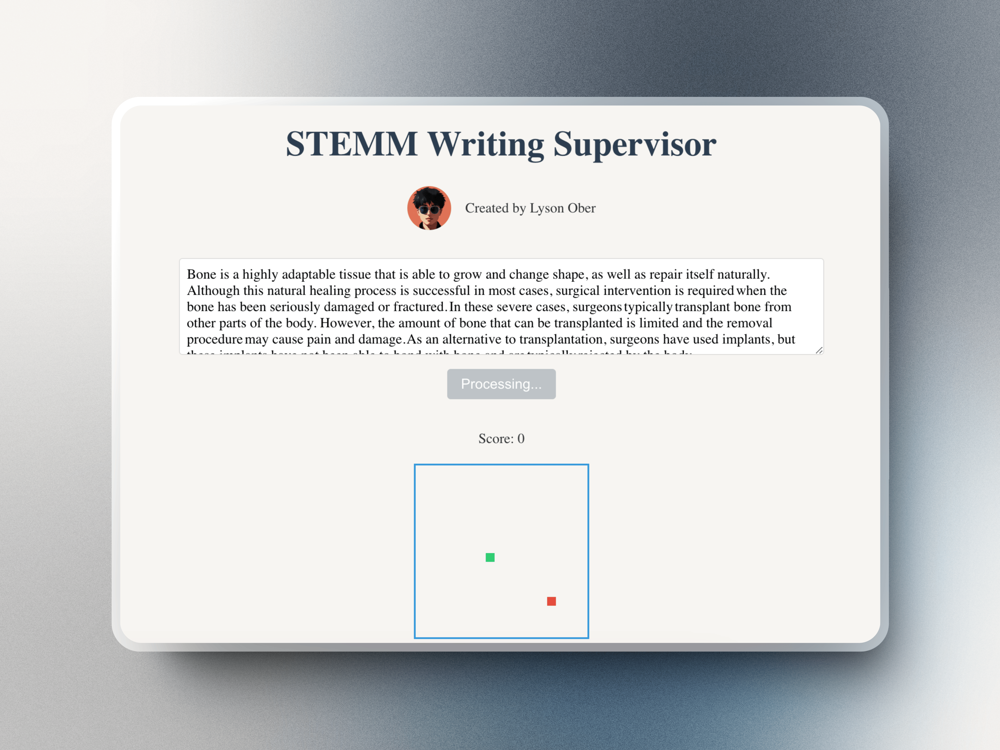

# Dify.ai STEMM Writing Supervisor

---

## STEMM Writing Enhancement

The Dify.ai STEMM Writing Supervisor is an advanced tool designed to elevate your STEMM (Science, Technology, Engineering, Mathematics, and Medicine) writing to meet rigorous academic standards. By inputting a paragraph or complete article in STEMM style, users receive a highly polished, academically appropriate version of their text.

Key features include:

- Grammar correction
- Removal of superfluous clauses and unnecessary connectives
- Improved paragraph cohesion using substantive nouns
- Refinement of topic sentences
- Implementation of complex strategies to enhance STEMM writing quality
- Reader-friendly

This sophisticated tool employs a range of techniques to transform your initial draft into a clear, concise, and academically sound piece of writing.

`👆 Click the button above to deploy to Zeabur with one click, but you need to manually add an environment variable named VITE_API_KEY, with the value being the API_Key of your Dify App`

## UI Project Description

This project includes a simple demo UI, collaboratively developed with Bolt.new. The interface allows for easy connection to Dify Apps and serves as a foundation for customization.

Key aspects:

- Seamless integration with Dify Apps
- User-friendly interface
- Customizable design to meet specific needs

This demo provides a starting point for those looking to create a tailored UI for their Dify-powered applications. Users can modify the interface to align with their unique requirements while maintaining the core functionality of connecting to Dify Apps.

## Contact and Resources 📞🔗

Stay connected and learn more about Dify:

1. 🐦 **Latest Updates**: Follow Lyson Ober on X (Twitter) for the most recent information:
   [https://x.com/lyson_ober](https://x.com/lyson_ober)
2. 🌐 **Tutorials and Resources**: Visit [Dify101.com](https://Dify101.com) for Dify tutorials, course materials, and recommendations.
3. 🎥 **Video Content**: Subscribe to Lyson Ober's YouTube channel for Dify course content:
   [https://www.youtube.com/@lysonober](https://www.youtube.com/@lysonober)

We encourage you to explore these resources to enhance your Dify experience! 🚀🤖

## One More Thing

☝️ My friend riino has also created a Word annotation program based on this Dify Chatflow. If you input a Word document, it will automatically generate annotations to guide you in revising the Word document. You can view the details here:[ Notion Introduction](https://gist.github.com/sorphwer/7dc0558cd88af0c15b113b29acdb96c9)

- WeChat: Sorphwer
- Personal website: riino.site